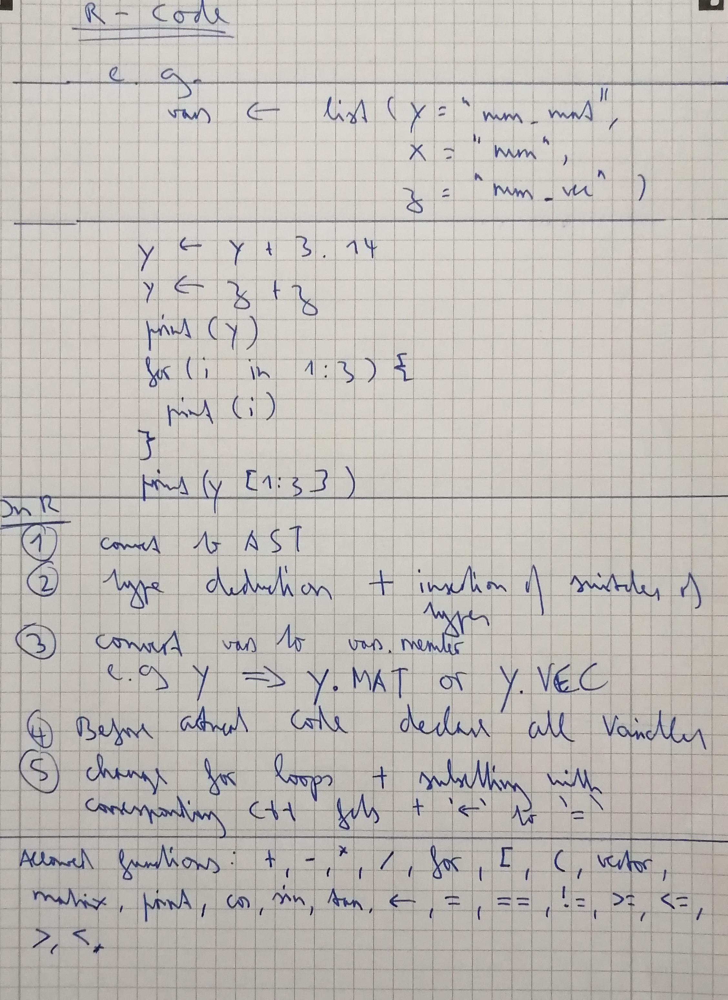
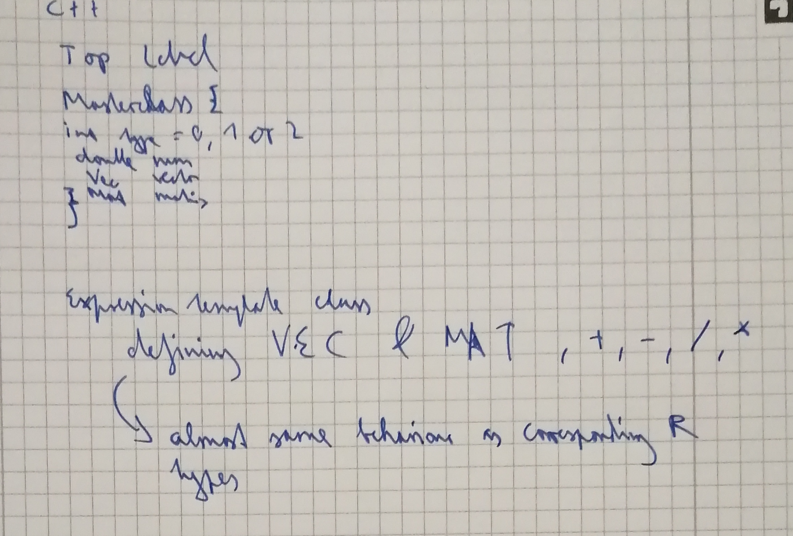

```{r setup, include=FALSE}
knitr::opts_chunk$set(echo = TRUE)
```

# Internals

The user passes R code which defines the body of the function to be translated. Furthermore, the information of the types for the arguments passed to the function have to be defined.

* Get Abstract Syntax Tree (AST) from R Code
* Deduce Types of all code lines with an assignment
* Translate AST to C++ Code

In C++ an expression template library is used which has scalars, vectors and matrices which behave as much as possible as the corresponding R objects. 

\newpage



\newpage

