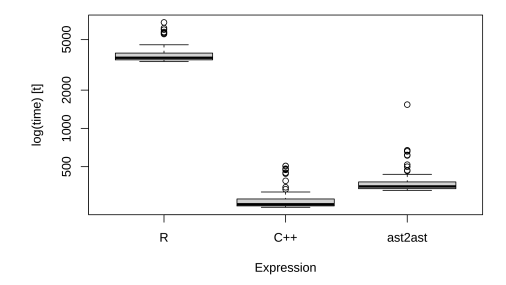

```{r setup, include=FALSE}
knitr::opts_chunk$set(echo = TRUE, eval = FALSE)
```

```{css echo=FALSE}
/* Define a margin before h2 element */
h2  {
  margin-top: 6em;
}

/* Define a margin after every first p elements */
p:first-of-type {
  margin-bottom: 3em;
}
```

- [Documentation](#documentation)
  * [Objects](#objects)
  * [Variable declaration](#variable-declaration)
  * [Basic arithmetics](#basic-arithmetics)
  * [Subsetting](#subsetting)
  * [Helper functions](#helper-functions)
  * [Comparison functions](#comparison-functions)
  * [Control flow](#Control flow)
  * [Printing](#printing)
  * [Math functions](#math-functions)
  * [Interpolation](#interpolation)

<style>
body {
text-align: justify}
</style>

## Documentation

The package *ast2ast* translates an R function into a C++ function. Either an external pointer (XPtr) or an R function is returned. The scope of *ast2ast* is to generate functions that can be used during solving ode-systems (derivative function or jacobian function) or during optimization. More generally, the translated function can be used in fields where it is necessary to evaluate a function very often. Especially when the function is evaluated by C++ the generated external pointer is very sufficient see the benchmark below. \
Within this vignette the functions supported by *ast2ast* are presented. The examples are presented using the R output form. If the XPtr output differs this is described.
First of all, the supported objects and functions listed below are explained in detail. Here, the arguments which have to be passed to the functions are described and it is explained what the function returns. Furthermore, for each function, a small example is given showing how to use it. Moreover, it is explained how the function differs from R equivalents. If another differences are detected please report them. \



Supported objects:

*  vectors (containing numbers)
*  matrices (containing numbers)

Supported functions:

*  assignment: = and <-
*  allocation: vector and matrix
*  information about objects: length and dim
*  Basic operations: +, -, *, /
*  Indices: [] and at
*  mathematical functions: sin, asin, sinh, cos, acos, cosh, tan, atan, tanh, log, ^ and exp
*  concatenate objects: c
*  control flow: for, if, else if, else
*  comparison: ==, !=, >, <, >= and <=
*  printing: print
*  returning objects: return
*  is.na and is.infinite can be used to test for NA and Inf.
*  d-, p-, q- and r-unif, -norm, -lnorm and -gamma (for gamma argument *Scale* cannot be defined and is calculated using *1/rate*)

### Objects

There exist two containers that can be used in *ast2ast* functions. Both containers can only hold the *numeric* type of R (which is equivalent to double). The first container is a vector and the second one is a matrix. **It is possible to declare a variable of a scalar numeric data type. This is done by adding *\_db* (e.g. varname\_db) to the end of the variable. Each time *\_db* is found the variable is declared as a scalar numeric data type. In this case, the object cannot change its type!** \
It is pivotal to follow the rules of variable naming in C++. For instance, it is not allowed to use '*.*' in variable names.

**Features of *ast2ast* **

* The variables can change the type within a function. This is usually not possible when using C++. 
* The index of vectors and matrices starts at 1 as in R.
* The index has to be in the boundaries of the vector or matrix. Even though this is different from the behavior in R it is a nice feature. If you access an element outside the boundaries of a vector in R *NA* is returned. 
* The memory of the matrices is arranged column-wise as in R. 
* In R arguments passed to a function are always copied. Here the R function behaves differently then the external pointer. 
  * If using "R" for the *output* argument of *translate* then the function expects *SEXP* objects. These objects can be modified as long as the size is not increased (see **Example 1**).
  * If using "XPtr" for the *output* argument of *translate* the variables can be passed by reference. Meaning to only pass the memory address of an object (called a reference). To do this, you     have to set the *reference* parameter to *TRUE*. If you pass a function by reference you can modify the object without returning it. Notably, if no *return* is used in the R code translated     by *ast2ast* nothing is returned (in R the last object is returned in this case). You see that x is 10 before the call of the function and it is 1 after the call of the function. But the       function does not return anything. Thus, the object *x* is modified in the function without copying it. 


**Example 1**
```{r modify objects, eval = TRUE}
f <- function(variable) {
  variable <- 1
}
library(ast2ast)
fetr <- translate(f)
x <- 10
return_value <- fetr(x)
print(x)
print(return_value)
```

**Caveats:**

* Sometimes large overhead of the containers
  * Overhead is generated due to code injection. This is especially true if "R" is used for the output argument.
  * Variables which are scalars are represented as vectors of length 1. As in C++ scalar variables are not defined as vectors the speed of the translated R function can be substantially lower      compared to a native C++ function. 


### Variable declaration

In **Example 2** the various ways of declaring variables are presented. To assign a value to a variable you can use *<-* or *=*. As already mentioned only numeric values are possible. 
If you want to assign a vector you can use either the *c* or *vector* function. The *c* function works in the same way as R and can handle any combinations of scalars, vectors or matrices. The function *vector* differs in two ways from the R equivalent. First of all, you cannot use terms such as *vector(length = size)* as this is not possible in C++. In contrast, you just write *vector(size)*. The R function *rep* is not available in *ast2ast* but it is possible to write *vector(value, size)* which in R would be written as *rep(value, size)*. A third way to use the *vector* function is to pass another vector and the size e.g. *vector(other_vector, size)*. The *matrix* function works in the same way as the *vector* function. However, instead of the size, two arguments are needed the number of rows and the number of columns.

**Example 2**
```{r}
f <- function() {
  a <- 1
  a_db <- 3.14
  b = 2
  c <- c(1, 2, 3)
  d = vector(2)
  e <- vector(3.14, 4)
  f <- vector(c, 3)
  g <- matrix(2, 2)
  h <- matrix(6, 2, 2)
  i <- matrix(e, 2, 2)
  
  print("a")
  print(a)
  print(a_db)
  print()
  print("b")
  print(b)
  print()
  print("c")
  print(c)
  print()
  print("d")
  print(d)
  print()
  print("e")
  print(e)
  print()
  print("f")
  print(f)
  print()
  print("g")
  print(g)
  print()
  print("h")
  print(h)
  print()
  print("i")
  print(i)
  print()
}
library(ast2ast)
fetr <- translate(f)
fetr()
```

### Basic arithmetics

As usual in R it is possible to use basic arithmetic operations on scalars, vectors and matrices (**Example 3**).

**Example 3**
```{r}
f <- function() {

a <- 2
b <- 3
print("scalar operations")
print(a + b)
print(a - b)
print(a / b)
print(a * b)

print()

print("vector & scalar operations")
a <- c(1, 2, 3)
b <- 4
print(a + b)
print(b - a)

print()

print("2 vectors (same length)")
a <- 6:8
b <- 1:3
print(a / b)
a <- 1:6
b <- 1:3
print(a / b)
print("2 vectors (different length)")
print("multiple of each other")
a <- 1:6
b <- 1:3
print(a / b)
print("not a multiple of each other")
a <- 1:5
b <- 1:3
print(a / b) # different to R no warning

print()

print("matrix & scalar operations")
a <- 3
b <- matrix(3, 2, 2)
print(a*b)
print(b + 4)

print()

print("matrix & vector operations")
a <- 5:6
b <- matrix(3, 2, 2)
print(b - a)
print(a / b)

print()

print("matrix & matrix operations")
a <- matrix(3, 2, 2)
b <- matrix(4, 2, 1) # difference to R!
print(a + b)

print()

print("mixed operations")
a <- 1
b <- 2:5
c <- matrix(50, 2, 2)
d <- a + b - c/2
print(d)
}

library(ast2ast)
fetr <- translate(f)
fetr()
```


### Subsetting

If you want to subset a vector or a matrix object you can use either *[]* or the *at* function. The *[]* is slower than *at* but more powerful (**Example 4**).

The following objects can be passed to *[]* when using a vector or matrix:

* nothing
* numeric scalar
* logical
* vector
* matrix
* result of comparison

In case of a matrix, it is possible to pass one of the above objects to access specific rows or columns respectively ([rows, cols]). \

In contrast to *[]*, the *at* function accepts only a scalar or two scalars for vectors or matrices, respectively. Thus, only a single element is accessed by this function! However, this function works faster. The result of *at* cannot be subsetted further. The *at* function returns the numeric type which is used when a variable is declared with the extension *\_db*. 

**Example 4**
```{r}
f <- function() {

print("pass nothing")
a <- 1:8
print(a)
a[] <- 100
print(a)
print()

print("pass logical")
a <- 1:8
print(a)
a[TRUE] <- 100
print(a)
print()

print("pass scalar")
a <- 1:8
print(a)
a[1] <- 100
print(a)
print()


print("pass vector")
a <- 1:8
b <- 2:5
print(a)
a[b] <- 100
print(a)
print()

print("pass result of ==")
a <- 1:8
a[a < 5] <- 100
print(a)
print()


print("pass result of !=")
a <- 1:8
b <- c(1, 2, 3, 0, 0, 0, 0, 8)
a[a != b] <- 100
print(a)
print()


print("pass result of <=")
a <- 1:8
b <- c(1, 2, 3, 0, 0, 0, 0, 8)
a[a <= b] <- 100
print(a)
print()


print("pass result of >=")
a <- 1:8
b <- c(1, 2, 3, 0, 0, 0, 0, 9)
a[a >= b] <- 100
print(a)
print()


print("pass result of >")
a <- 1:8
b <- c(0, 2, 3, 0, 0, 0, 0, 9)
a[a > b] <- 100
print(a)
print()


print("pass result of <")
a <- 1:8
b <- c(0, 2, 3, 0, 0, 0, 0, 9)
a[a < b] <- 100
print(a)
print()


print("pass scalar, scalar")
a <- matrix(3, 4, 4)
a[1, 1] <- 100
print(a)
print()


print("pass vector, vector")
a <- matrix(3, 4, 4)
b <- c(1, 3)
c <- c(2, 4)
a[b, c] <- 100
print(a)
print()


print("pass ==, >=")
a <- matrix(1:16, 4, 4)
b <- 1:4
c <- c(1, 8, 3, 8)
a[b == c, b >= c] <- 100
print(a)
print()


print("at")
a <- 1:16
at(a, 2) <- 100
print(a)
print()


print("at")
a <- matrix(1:16, 4, 4)
at(a, 1, 4) <- 100
print(a)
print()
}

library(ast2ast)
fetr <- translate(f)
fetr()
```

### Helper functions

There exist three helper function. The *length* function returns the number of elements of a vector or matrix. The *dim* function returns the number of rows and columns of a matrix. The *:* function can be used to create a range of numbers. For example 1:3 creates a vector with the elements 1, 2 and 3 or 1.1:5.3 returns a vector with the elements 1.1, 2.1, 3.1, 4.1 and 5.1. See **Example 5** in order to see how the functions can be applied. 

**Example 5**
```{r}
f <- function() {
  a <- 1:4
  print(a)
  a <- 1.1:5.2
  print(a)
  
  a <- 1:16
  print(length(a))
  
  b <- matrix(1:4, 2, 2)
  print(dim(b))
}

library(ast2ast)
fetr <- translate(f)
fetr()
```

### Comparison functions

As usual in R it is possible to compare two objects using one of the following options (**Example 6**):

* \=\=
* <=
* \>\=
* !=
* \<
* \>

**Example 6**
```{r}
f <- function() {
  a <- 1:4
  b <- c(1, 2, 3, 5)
  c <- 9
  print(a == b)
  print(a <= b)
  print(a >= b)
  print(a != b)
  print(a < c)
  print(a > c)
}

library(ast2ast)
fetr <- translate(f)
fetr()
```

### Control flow

It is possible to write for-loops and 'if', 'else if', and 'else' branches as in native R (**Example 7**).

for(index in variable){ \
    # do whatever \
} \
for(index in 1:length(variable){ \
    # do whatever \
} \

**Example 7**
```{r}
f <- function() {
  a <- 1:4
  for(i in a) {
    print(i)
  }
  
  for(i in 1:length(a)) {
    a[i] <- i + i 
  }
  
  for(i in 1:length(a)) {
    if(i < 4 && i > 1) {
      print(i)
    }
  }

}

library(ast2ast)
fetr <- translate(f)
fetr()
```


### Printing

Using the function print as common in R (see **Examples 2, 3, 4, 5, 6**):

* print() is different to R
* print("string")
* print(logical)
* print(scalar)
* print(vector) is different to R
* print(matrix)

### Math functions

Following mathematical functions are available (see **Example 8**):

* sin
* asin
* sinh
* cos
* acos
* cosh
* tan
* atan
* tanh
* sqrt
* log
* ^ and exp
* d-, p-, q- and r-unif, -norm, -lnorm and -gamma (for gamma argument *Scale* cannot be defined and is calculated using *1/rate*)

**Example 8**
```{r}
f <- function() {
  a <- 1:4
  print(sin(a))
  print(cos(a))
  print(a^2)
  print(exp(a, 3))
}

library(ast2ast)
fetr <- translate(f)
fetr()
```


### Interpolation

To interpolate values, the 'cmr' function can be used. The function needs three arguments (see **Example 9**):

* the first argument is the point of the independent variable (x) for which the dependent variable should be calculated (y). This has to be a vector of length one.
* the second argument is a vector defining the points of the independent variable (x). This has to be a vector of at least length four.
* the third argument is a vector defining the points of the dependent variable (y). This has to be a vector of at least length four.

**Example 9**
```{r}
f <- function() {
  dep <- c(0, 1, 0.5, 2.5, 3.5, 4.5, 4)
  indep <- 1:7
  
  evalpoints <- c(0.5, 1, 1.5, 2, 2.5,
                  3, 3.5, 4, 4.5, 5,
                  5.5, 6, 6.5)
  for(i in evalpoints) {
    print(cmr(i, indep, dep))
  }
}

library(ast2ast)
fetr <- translate(f)
fetr()
```


