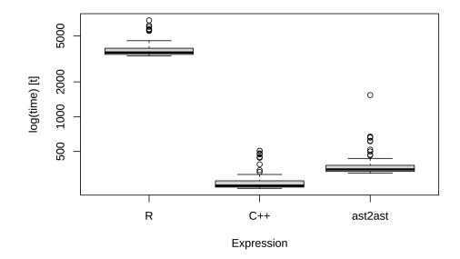

```{r setup, include=FALSE}
knitr::opts_chunk$set(echo = TRUE, eval = FALSE)
```

```{css echo=FALSE}
/* Define a margin before h2 element */
h2  {
  margin-top: 6em;
}

/* Define a margin after every first p elements */
p:first-of-type {
  margin-bottom: 3em;
}
```

<style>
body {
text-align: justify}
</style>

## Overview

The *ast2ast* package translates R functions into C++ functions,
returning either an external pointer (XPtr) or an R function.
This package is particularly useful for tasks requiring frequent function evaluations,
such as solving ODE systems or optimization problems.
Using the external pointer generated by C++ can significantly enhance performance,
as shown in the benchmark below.



Supported objects:

*  scalar values
*  vectors
*  matrices
*  arrays
*  custom types (structs) and collections thereof, see `new_type` below

Supported functions:

*  assignment: `=`, `<-`, and `$` (struct field access/assignment)
*  allocation: `vector`, `logical`, `integer`, `numeric`, `:`, `c`, `rep`, `matrix`, and `array`
*  some helpers: `length`, `dim`, `nrow`, `ncol`, `is.na`, `is.nan`, `is.finite`, `is.infinite`, `print`, and `stop`
*  Math functions: `+`, `-`, `*`, `/`, `%%`, `%/%`, `%*%`, `sin`, `asin`, `sinh`, `cos`, `acos`, `cosh`, `tan`, `atan`, `tanh`, `log`, `sqrt`, `abs`, `^`, `exp`, `floor`, `ceiling`, and `trunc`
*  reductions: `sum`, `prod`, `max`, `min`, `which.max`, `which.min`, `all`, `any`, `rev`
*  linear algebra: `t`, `chol`, `crossprod`, `tcrossprod`, `diag`, `get_diag`, `solve`, `backsolve`, `forwardsolve`, `rbind`, `cbind`
*  root finding / least squares: `uniroot`, `nnls`
*  casts: `as.numeric`, `as.integer`, `as.logical`
*  sequences: `seq_len`, `seq_along`
*  Subsetting: `[]` and `[[]]`
*  control flow: `for`, `while`, `repeat`, `if`, `else if`, and `else`
*  comparison: `==`, `!=`, `>`, `<`, `>=`, and `<=`
*  logical: `&&`, `||`, `&`, `|`, `!`
*  derivative: `seed`, `unseed`, `get_dot`, `deriv`
*  inner functions: `fn`, see below

### Type system in ast2ast

### Overview

R is dynamically typed, while C++ is statically typed. When translating an R function, **ast2ast** must decide static C++ types for:

1. the **arguments** of `f`, and
2. the **variables created inside** `f`.

In **ast2ast**, every type is a combination of:

- a **base type**: `logical`, `integer` (or `int`), `double`
- a **structure**: `scalar`, `vector` / `vec`, `matrix` / `mat`

Typical types are therefore:

- `double` (scalar double)
- `vec(double)` / `vector(double)` (double vector)
- `mat(double)` / `matrix(double)` (double matrix)

A key difference to R: **ast2ast scalars are true scalars**, not length-1 vectors. Scalars cannot be subset using `[]` or `[[ ]]`.

Another difference to R: **negative indices are not supported** (R's `v[-1L]`
drop-element form). Indices must be positive and 1-based.

---

## Setting types for function arguments

### Default behavior

If `args_f = NULL`, all arguments default to: `matrix(double)`, as this is most convinient for numeric code.

---

### Using `args_f`

To control argument types, provide a helper function via `args_f`. It has the same argument list as `f` and assigns types using `type()`:

```{r, eval = FALSE}
f_args <- function(a, b, c) {
  a |> type(vec(double))
  b |> type(mat(double))
  c |> type(double)
}
f_cpp <- ast2ast::translate(f, args_f = f_args)
```

---

### Borrowing, constness, and references

For arguments, you can additionally control how values are passed:

- `borrow_vec(...)`, `borrow_mat(...)`: borrow memory (no copy)
- `const()`: disallow modification
- `ref()`: pass by reference (only valid when `output = "XPtr"`)

Example:

```{r, eval = FALSE}
f_args <- function(a, b, c) {
  a |> type(borrow_vec(double)) |> ref()           # mutable, passed by reference
  b |> type(borrow_mat(double)) |> ref() |> const()# read-only matrix reference
  c |> type(double) |> ref()                       # scalar reference (XPtr only)
}
```

Notes:

- Borrowed arguments are useful for avoiding allocations and modifying inputs in place.
- `const()` is enforced by the static checker at translation time ("You cannot assign to a constant variable"), before any C++ compilation happens.
- `ref()` is primarily intended for the external pointer interface.

---

### Setting types for variables inside the function

Types inside `f` are often inferred automatically from:

- the first assignment, and/or
- the constructor used (`numeric()`, `matrix()`, `integer()`, etc.)

You can override inference using explicit annotations.

---

### Immutability of types

Once a variable has a type, it cannot change its base type or structure. This follows C++ rules.
For example, you cannot first treat a variable as `scalar(double)` and later assign a scalar `double` to it.
If you need a different type or structure, create a new variable with a new name.

---

### Type promotion

When two differently-typed operands are combined (e.g. `integer + double`), ast2ast
picks a common result type along two independent precedence orders:

- base type: `logical` < `integer` (`int`) < `double`
- structure: `scalar` < `vector` (`vec`) < `matrix` (`mat`) < `array`

The result takes the higher-precedence base type and the higher-precedence structure
of the two operands, e.g.:

- `logical + integer` -> `integer`
- `integer + double` -> `double`
- `double` (scalar) `+ vec(double)` -> `vec(double)`

A few operators promote unconditionally, regardless of what they're given:

- `/` and `^` always produce `double` (R never returns an integer from division or
  exponentiation)
- transcendental functions (`sin`, `sqrt`, `log`, `exp`, ...) always return `double`
- `sum()` keeps `double` as `double`, but promotes `logical`/`integer` to `integer`
  (matches R's own `sum()` behavior)

This same promotion also finalizes a locally-inferred variable's type from its
first few uses when it was not given an explicit `type()` annotation; once
fixed, that type is immutable (see above).

## Derivatives

The ast2ast package provides built-in support for automatic differentiation (AD) in both forward mode and reverse mode.
Derivative support is enabled when translating a function via the derivative argument:

```{r, eval = FALSE}
fcpp <- ast2ast::translate(f, derivative = "forward")
fcpp <- ast2ast::translate(f, derivative = "reverse")
```

Unlike many high-level AD frameworks, ast2ast intentionally exposes a low-level and explicit interface.
Rather than automatically differentiating a function or providing a single jacobian() wrapper,
users explicitly assemble derivative computations using a small set of primitive operations.
This design keeps the behavior transparent, predictable, and close to the generated C++ code.

### Forward mode

In forward mode, derivatives are propagated alongside values. Internally, each scalar carries both its value and its directional derivative (also called its dot value).
The following functions are available:

* seed(x, i): Activates the i-th component of x as the differentiation direction (sets its derivative to 1).
* unseed(x, i): Resets the derivative state of the i-th component.
* get_dot(y): Extracts the directional derivatives of y.

A typical pattern is to compute Jacobians column-by-column by looping over the input variables:

```{r, eval = FALSE}
f <- function(y, x) {
  jac <- matrix(0.0, length(y), length(x))
  for (i in 1L:length(x)) {
    seed(x, i)

    y[[1L]] <- x[[1L]] * x[[2L]]
    y[[2L]] <- x[[1L]] + x[[2L]] * x[[2L]]

    d <- get_dot(y)
    jac[TRUE, i] <- d

    unseed(x, i)
  }
  return(jac)
}

fcpp_forward <- ast2ast::translate(f, derivative = "forward")
```

Forward mode is most efficient when the number of inputs is small relative to the number of outputs.

### Reverse mode

In reverse mode, derivatives are accumulated by propagating sensitivities backward from
the outputs to the inputs. This is particularly efficient when the number of outputs is small relative to the number of inputs.

Reverse mode provides the function:

* deriv(y, x): Computes the Jacobian of y with respect to x.

Example:

```{r, eval = FALSE}
f <- function(y, x) {
  y[[1L]] <- x[[1L]] * x[[2L]]
  y[[2L]] <- x[[1L]] + x[[2L]] * x[[2L]]
  jac <- deriv(y, x)
  return(jac)
}

fcpp_reverse <- ast2ast::translate(f, derivative = "reverse")
```
The call to deriv() must appear explicitly in your function body. No automatic differentiation is performed unless requested.

### Design philosophy

Derivative computation in ast2ast is explicit by design.
The full control flow—loops, seeding, unseeding, derivative extraction, and accumulation—is written directly in R and translated into C++.

This approach:
* avoids hidden performance costs,
* makes derivative logic easy to inspect and debug,
* gives full control over memory and evaluation order,
* maps naturally to high-performance C++ code.

Rather than hiding differentiation behind abstractions, ast2ast treats derivatives as first-class values that can be manipulated like any other object.

## Inner functions

Functions can be defined inside `f` using `fn()`. This is required whenever a function
needs to be passed as a value, e.g. to `uniroot()`. An inner function is declared with
three parts: `args_f` (types of its arguments, same as the top-level `args_f`),
`return_value` (its return type via `type()`), and `block` (the R code, same signature
as `args_f`). `block`'s body does not need to be wrapped in `{ }` for a single statement,
but wrapping it is fine too.

```{r, eval = FALSE}
f <- function(a) {
  factorial <- fn(
    args_f = function(a) a |> type(int) |> const(),
    return_value = type(int),
    block = function(a) {
      if (a == 1L) return(a) else return(a * factorial(a - 1L))
    }
  )
  return(factorial(a))
}
fcpp <- ast2ast::translate(f, args_f = function(a) a |> type(int))
```

An inner function's non-`const` parameters only bind to bare variables passed at the
call site, not to arbitrary expressions (e.g. `x + 1`, `x[[1L]]`) -- a non-`const`
parameter is a mutable reference to the caller's argument, and an expression has no
addressable storage to reference. Declare the parameter `const()` if you need to pass
an expression:

```{r, eval = FALSE}
sq <- fn(
  args_f = function(x) x |> type(double) |> const(),  # const -- accepts expressions
  return_value = type(double),
  block = function(x) return(x * x)
)
# sq(a + b) is fine; without const() on x, only sq(a) (a bare variable) would be.
```

Inner functions can call each other (including mutual recursion) and can be passed to
functions expecting a function argument, e.g. `uniroot`:

```{r, eval = FALSE}
f <- function(interval) {
  g <- fn(
    args_f = function(x) x |> type(double),
    return_value = type(double),
    block = function(x) {
      return(x^2 - 4)
    }
  )
  res <- uniroot(g, interval, 1e-10, 1000)
  return(res$root)
}
fcpp <- ast2ast::translate(f, args_f = function(interval) interval |> type(vec(double)))
```

`uniroot(f, interval, tol, maxiter)` returns a struct with fields `root`, `f_root`,
`iter`, and `estim_prec` (accessed via `$`, see custom types below). `f` must take a
single `double` and return a `double`; an optional fifth argument is passed through to
`f` as extra data (`f` then takes two arguments).

`nnls(A, b)` solves the non-negative least squares problem and returns the solution
vector directly.

## Custom types (`new_type`)

Besides scalars, vectors, matrices and arrays, **ast2ast** supports user-defined struct
types. They are declared via a `types_f` helper function (analogous to `args_f`) and
passed to `translate()`:

```{r, eval = FALSE}
types_f <- function() {
  new_type(Point, slots(x |> type(double), y |> type(double)))
}

f <- function(p) {
  p$x <- p$x + 1
  return(p)
}

fcpp <- ast2ast::translate(
  f,
  args_f = function(p) p |> type(Point),
  types_f = types_f
)

p <- structure(list(x = 1, y = 2), class = "Point")
fcpp(p)
```

Notes:

- On the R side, a value of a custom type is a named `list` with a matching `class`
  attribute, e.g. `structure(list(x = 1, y = 2), class = "Point")`.
- Slots can themselves be custom types, allowing nested structs.
- `collection(TypeName)` is a vector of a custom type, e.g.
  `slots(points |> type(collection(Point)))` or, as a local variable,
  `coll |> type(collection(Point))`. Allocate one with
  `vector(mode = "Point", n)`.
- Fields are read and written with `$`, including chained access such as
  `s$circles[[1L]]$center$x`.

## Interpolation

To interpolate values, the 'cmr' function can be used. The function needs three arguments.

* the first argument is the point of the independent variable (x) for which the dependent variable should be calculated (y). This has to be a scalar (a length-one vector triggers a warning and only uses its first element).
* the second argument is a vector defining the points of the independent variable (x). This has to be a vector of at least length four.
* the third argument is a vector defining the points of the dependent variable (y). This has to be a vector of at least length four.

```{r, eval = FALSE}
f <- function() {
  dep <- c(0, 1, 0.5, 2.5, 3.5, 4.5, 4)
  indep <- 1:7
  evalpoints <- c(
    0.5, 1, 1.5, 2, 2.5,
    3, 3.5, 4, 4.5, 5,
    5.5, 6, 6.5
  )
  for (i in evalpoints) {
    print(cmr(i, indep, dep))
  }
}
```


