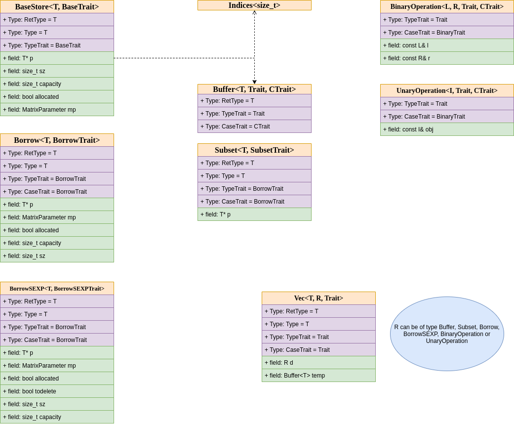

```{r setup, include=FALSE}
knitr::opts_chunk$set(echo = TRUE, eval = FALSE, cache = FALSE)
```


<style>
body {
text-align: justify}
</style>

```{css echo=FALSE}
/* Define a margin before h2 element */
h2  {
  margin-right: 6em;
}

/* Define a margin after every first p elements */
p:first-of-type {
  margin-bottom: 3em;
}
``` 

- [Guidance for Package Authors](#guidance-for-package-authors)
- [Naming rationalization ast2ast](#naming-rationalization-ast2ast)
- [Comparison of R and ETR code](#comparison-of-r-and-etr-code)
- [The XPtr interface](#the-xptr-interface)
- [Internals of ETR](#internals-of-etr)


## Guidance for Package Authors

This section of the documentation describes how the external pointers to C++ function that are produced by *ast2ast* can be used in other packages.
This information is intended for package authors who want to use the translated functions within their own code.
Additionally, this section endeavors to present pertinent implementation details, providing valuable insights into the inner workings of the process.

## Naming rationalization ast2ast

The nomenclature of the package, ast2ast, is rooted in the abbreviation *ast*, signifying abstract syntax tree. 
Originally I planned to convert the abstract syntax tree of R to the C++ tree as the literature recommended for transpilers.
However, through iterative refinement, a more optimal methodology emerged.
The development incorporated an Expression Template Library in C++ known as ETR, meticulously crafted to mimic R.
Thus, R code is translated into ETR code, which is subsequently compiled.
The original ETR library is accessible at https://github.com/Konrad1991/ETR. 
It's imperative to note that the version integrated into ast2ast has undergone substantial enhancements, amplifying its efficacy and adaptability.

## Comparison of R and ETR code

Displayed below is a basic bubble sort function implemented in R on the left, juxtaposed with its ETR counterpart on the right.
It is obvious that the two code snippets are quite similar. 
Remarkably, the overall structure of the R code remains unaltered. 
Instead, the substitution of individual functions with their ETR equivalents forms the crux of the transformation. \
In the C++ code, all functions are located in the *etr* namespace.
Certain functions share identical names in both R and C++, such as the *length* function.
To mitigate potential conflicts, these calls are modified to explicitly reference the etr namespace, 
resulting in expressions like *etr::length*. Other functions as for example *`:`* and *`[`* cannot be defined in C++ (at least not in the way they are used in R)
therefore they are replaced by functions with new names e.g. *etr::colon* and *etr::subset*. \
Additionally, C++ necessitates explicit declaration of variable types. 
Within this example for all variables the type *Vec<double>* is used. A detailed explanation is deferred to the subsequent section.

```{r, eval = FALSE, echo = TRUE, attr.source='.numberLines'}
bubbleSort <- function(a) {
  size <- length(a)
  for (i in 1:size) {
    for (j in 1:(size - 1)) {
      if (a[j] > a[j + 1]) {
        temp <- a[j]
        a[j] <- a[j + 1]
        a[j + 1] <- temp
      }
    }
  }
  return(a)
}
```

```{Rcpp, eval = FALSE, echo = TRUE, attr.source='.numberLines'}
// [[Rcpp::depends(ast2ast)]]
// [[Rcpp::depends(RcppArmadillo)]]
// [[Rcpp::plugins(cpp2a)]]
#include "etr.hpp"

// [[Rcpp::export]]
SEXP bubbleSort(SEXP aSEXP) {
	etr::Vec<double> size;
	etr::Vec<double> temp;
	etr::Vec<double> a; a = aSEXP;

	 size = etr::length(a);
	 for (auto&i:  etr::colon(etr::i2d(1), size)) {
	     for (auto&j:  etr::colon(etr::i2d(1), (size - etr::i2d(1)))) {
	         if (etr::subset(a, j) > etr::subset(a, j + etr::i2d(1))) {
	             temp = etr::subset(a, j);
	             etr::subset(a, j) = etr::subset(a, j + etr::i2d(1));
	             etr::subset(a, j + etr::i2d(1)) = temp;
	         }
	     }
	 }
	 return(etr::cpp2R(a));
}
```


### The XPtr interface 

The XPtr interfaces creates an external pointer which can be used in other C++ programs. 

#### First, one creates the external pointer of the R function. 

```{r, eval = TRUE, echo = TRUE}
f <- function(a, b) {
  c <- a + b
  return(c)
}
fcpp <- ast2ast::translate(f,
  output = "XPtr",
  types_of_args = c("double", "double"),
  data_structures = c("vector", "scalar"),
  handle_inputs = c("", ""),
  references = c(TRUE, TRUE)
)
```

#### Afterwards the external pointer is used in an R package

```{Rcpp, eval = TRUE, echo = TRUE}
// [[Rcpp::depends(ast2ast)]]
// [[Rcpp::depends(RcppArmadillo)]]
// [[Rcpp::plugins(cpp2a)]]
#include "etr.hpp"

typedef etr::Vec<double> (*FP)(etr::Vec<double>& a, etr::Vec<double>& b);

// [[Rcpp::export]]
void call_xptr(Rcpp::XPtr<FP> ep) {
  FP f = *ep;
  etr::Vec<double> a;
  etr::Vec<double> b;
  etr::Vec<double> c;
  a = etr::coca(1, 2, 3);
  b = etr::coca(4, 5, 6);
  c = f(a, b);
  etr::print(c);
}
```
#### call the function from the R package


```{r, eval = TRUE, echo = TRUE}
call_xptr(fcpp)
```


## Internals of ETR

### Fundamental Type in Expression Template Library R (ETR): Vec Class

The core type in the expression template library R (ETR) is a class called *Vec*.
Presuming a foundational familiarity with classes and templates in C++, we embark on a detailed exploration of the design inherent in this class.
The Vec class incorporates three templates, namely *T*, *R*, and *Trait*.
In this context, the typename *T* signifies a fundamental data type, while *R* represents another class (more details forthcoming).
The third template, *Trait*, plays a crucial role in endowing the class with identifiable properties as Vec during the compile-time phase. 
In the majority of instances, the template *T* is instantiated as a *double*, referred to as numeric in the context of R types.
On certain occasions, *T* is a *bool*, denoted as *logical* in the realm of R types.
The typename *R* represents another class this can be either: Buffer, BorrowSEXP, Borrow, Subset, UnaryOperation or BinaryOperation.
Each of these classes contributes distinct functionalities and features to the *Vec* class.
It is recommended to directly use only the classes Buffer, BorrowSEXP and Borrow.
The Subset class is yielded by calls to the function subset.
Whereas UnaryOperation or BinaryOperation are produced by invoking functions like *sin*, *cos*, *+* and *-*. \



### Thread safety

The class *Vec* is thread safe in the sense that no memory is associated with functions or global variables. Moreover, almost no static methods are defined.
An exception are the methods used for comparison. Notably, these comparison methods (*==*, *<=*, *>=*, *<*, *>* and *!=*) except two doubles (by copy) as arguments and return a bool.
Thus, it is still possible to use instances of the class in parallel. However, the user has to take care that only one thread edits an object at a time.

### Conversions 

A *sexp* can be converted to Rcpp::NumericVectors, Rcpp::NumericMatrices, arma::vec or to a arma::mat. 


